# Arcade-Raiden2_MiSTer

FPGA core for **Raiden II** (Seibu Kaihatsu, 1993) and **Raiden DX**
(1994) targeting the [MiSTer FPGA](https://github.com/MiSTer-devel)
platform (Terasic DE10-Nano).

Both games run on the same **Seibu Kaihatsu** board: a NEC V30 main CPU, a
Z80 sound CPU, three tilemaps plus a text layer, the SEI252 sprite
generator, YM2151 + two OKI MSM6295 for audio, and the **COP** — a Seibu
coprocessor that the game code drives with microcode tables stored in the
program ROM.

This core reimplements the hardware in SystemVerilog from MAME references,
the ROM microcode tables and hardware observation.

## About the games

**Raiden II** is the sequel to Seibu's 1990 landmark vertical shooter: the
same solid feel, two ships, and the trademark **plasma laser** that snakes
after enemies. **Raiden DX** builds on the same hardware a year later and
adds a branching course structure — Novice, Training and Expert routes with
their own stage order and scoring.

Both are driven by the **COP**, which the CPU asks for square roots, angles,
collision tests, DMA transfers, sorting and BCD conversion. Getting the COP
right is most of what makes these boards work.

## Status

**Current version: 1.0** (August 2026) — first public release.

The core runs both games end-to-end with video, audio, inputs and
savestates on real MiSTer hardware.

Some things are new in this release and are marked as such below: the
savestate slots and the CRT V-Size stage have been verified on hardware but
not yet exercised across every ROM set and every situation. See *Known
issues*.

## Known issues

- **Not every alternative ROM set has been played through.** All 34 sets are
  built from the same bitstream and load correctly, but only a few have been
  played at length. Reports are welcome.
- **Savestates are new here.** 32 slots across four files, working on
  hardware; still, treat them as a young feature. A slot that was never
  written is detected and ignored instead of loading garbage, and a
  savestate written by an older, different memory map is recognised and
  skipped rather than applied misaligned.
- **CRT Adjust affects the HDMI output too**, since the modified stream is
  what leaves the core. Use it on the analog output, and leave it Off for an
  untouched HDMI image.
- **CRT V-Size is experimental.** *PVM* mode moves the HSync (~0.35 % per
  line), so how far it goes depends on the monitor's horizontal lock —
  broadcast monitors follow it, arcade chassis usually refuse it. *Cabinet*
  mode cannot desync anything by construction; its cost is a very slight,
  uniform vertical softness. Leave V-Size at `0` for a bit-identical
  picture.
- **CRT V-Size in PVM mode has very little room on this game.** One step is
  one line; on a consumer TV the picture drops by about 17-25% in a single
  step once the field passes ~285 lines, because at that point the set stops
  treating the signal as 525/60 and re-presets its vertical deflection. This
  game natively runs a 282-line field, so only two fine steps fit underneath
  that threshold. It is not a defect of the core — see *CRT V-Size* below —
  and **Cabinet** mode has no such limit.
- **The native field is 282 lines at 55.4 Hz**, longer than a standard 60 Hz
  field. Some consumer CRTs pull their vertical oscillator between their two
  presets and the last couple of lines at the very bottom can look shifted.
  Professional monitors do not show it, and the **60 Hz** option (a 260-line
  field) removes it.
- **60 Hz mode runs the game 8.4% faster** — it shortens the field, it does
  not correct anything. In that mode the negative side of **V-Shift** is out
  of scale.

## Features

- NEC V30 main CPU @ 16 MHz, cycle-exact (wickerwaka's **ucore**)
- **Seibu COP** coprocessor: angles, square roots, collision, DMA, sorting,
  BCD — driven from the microcode tables in the game ROM
- Z80 sound CPU (T80) with the Seibu sound interface
- Background, Midground and Foreground tilemaps plus a text layer
- SEI252 sprite renderer with priority, flip and on-board decryption
- Audio: YM2151 (jt51) + **two** OKI MSM6295 (jt6295), with a per-channel
  mixer and an arcade audio filter
- Tile ROM streaming through SDRAM; sprite ROM and ADPCM ROM backed by DDR3
- **32 savestate slots**, selectable from the OSD, persistent across power
  cycles
- **Refresh Rate**: Original 55.4 Hz (board-accurate) or 60 Hz
- **Player 1P / 2P** selector — play solo as player 2 with a single pad
- TATE / vertical rotation support, with the analog path left untouched
- VBlank-synchronized pause (frame-aligned, no race conditions)
- **CRT Adjust**: H-Size, H-Position, V-Shift and **V-Size** (PVM /
  Cabinet), grouped behind a single On / Off switch
- MiSTer OSD with video, audio and DIP options

## ROM sets supported

**34 sets**, all from the same bitstream:

- **Raiden II** (22): US set 1 and 2, Japan, Hong Kong, Germany, France,
  Italy, Spain, Holland, Switzerland, Australia, Great Britain, the six
  "easier" revisions (Germany, Japan, Korea, US set 1/2/3), the "easier" US
  prototype 11-16, the "harder" Korean revision, the Korean revision that
  runs on **Raiden DX hardware**, and a GOD cheat version
- **Raiden DX** (12): US, UK, Japan set 1 and 2, Korea, China, Hong Kong
  set 1 and 2, Germany, Holland, Portugal, and a GOD cheat version

The MRA tells the core which board variant it is loading, so there is
nothing extra to install.

## The V30 CPU

The core runs **ucore**, Martin Donlon's cycle-exact NEC V30: a
microcode-level reimplementation validated against real V30 silicon, rather
than a behavioural model. Unlike Raiden 1, the Raiden II program ROMs are
**not encrypted** — on this board it is the **sprite** data that is
scrambled, and the core unscrambles it while the ROM is downloaded, so no
pre-decrypted ROMs are needed.

## The Seibu COP

The COP is a coprocessor sitting on the CPU bus that the game programs by
uploading **microcode tables** — sequences of opcodes that select which
internal operation runs. Those tables live in the program ROM, and they are
the authority on what the hardware really does: several commands documented
elsewhere are never issued by these games, and others exist in variants
that differ between Raiden II and Raiden DX.

The implementation here (`Raiden2_cop3.sv`) was written from those tables
and checked command by command against MAME, including the DMA modes, the
sorting used for the sprite list, the BCD conversion for the score and the
collision helpers. One example of what that buys: a Raiden DX-only command
(`0x7E05`) writes the foreground bank register from the COP instead of the
CPU — without it the DX layout is subtly wrong, and no amount of staring at
the CPU code explains why.

## CRT Adjust — the core-side analog geometry module

**CRT Adjust** is my own module, released standalone and shared by several
of my cores:

- Repository: [MiSTer-CRT-Adjust](https://github.com/rmonic79/MiSTer-CRT-Adjust)

From one always-on line buffer it gives live controls in the OSD, all
hidden behind a single **CRT Adjust** On / Off switch:

- **H-Size** — horizontal stretch / squeeze, bidirectional and integer
- **H-Position** — horizontal image shift
- **V-Shift** — vertical line shift
- **V-Size** — vertical stretch / shrink (see below)

The horizontal controls slide the **content** inside the line buffer and
leave the HSync byte-for-byte native, so they cannot desync anything. The
stretch is integer and line-buffered: each source pixel is held for a whole
number of pixel-clock periods, so there is **no shimmering, no blending and
no scaling artifact** on the analog output.

Why core-side? A cleaner approach exists as a module inside `sys_top`, where
only the analog DAC is touched and HDMI stays untouched — but the
MiSTer-devel guidelines say the framework (`sys/`) must not be modified.
CRT Adjust lives entirely **core-side** with zero `sys_top` changes, so the
core stays fully compliant. The trade-off: the adjust reaches the analog DAC
**and** HDMI follows it too — so leave CRT Adjust **Off** (default) for an
untouched HDMI output.

## CRT V-Size (experimental)

**V-Size** is the vertical companion. On this core one OSD step is **one
line** in PVM mode and three lines in Cabinet mode; "+" makes the picture
taller.

The frame rate cannot change — the game dictates it — so the height is
changed in one of two **exclusive** ways, selected from the OSD:

| | **PVM** — line retimer | **Cabinet** — photometric |
|---|---|---|
| Mechanism | retimes the total line count per frame: every line stays **unique**, zero artifacts — the vertical twin of H-Size | timing stays 100 % native: each source line's light is redistributed onto the fixed scanline grid (gamma-correct, energy-preserving) |
| HSync | moves ~0.35 % per line | untouched to the Hz — losing sync is physically impossible |
| Use on | broadcast monitors with a wide horizontal lock | arcade chassis, consumer TVs, anything that refuses frequency changes |
| Cost | the monitor must follow the frequency | a very slight, uniform vertical softness |

On this core the retimer knows **two absolute limits of the display** and
refuses to cross them, so it cannot be pushed into losing sync:

- the horizontal lock ceiling, as a shortest allowed output line
- the total number of lines per field

The second one is worth knowing about. Shrinking in PVM mode means *adding*
lines to the field, and past roughly **285 lines** a consumer TV stops
classifying the signal as 525/60 and re-presets its vertical deflection for
the 625 family — which is calibrated for 288 active lines, so our 240 fill
about 83% of it and the picture drops ~17% (~25% on a 16:9 preset) in one
step, with the sync perfectly locked and nothing clipped. This game runs a
282-line field, so that threshold is three lines away: two fine steps, then
the step down. A professional monitor never does this, and **Cabinet** mode
never changes the line count at all.

With V-Size at `0` the stage bypasses entirely and the image is
bit-identical to the untouched core.

## Screenshots

**Raiden II**

| | |
|---|---|
| 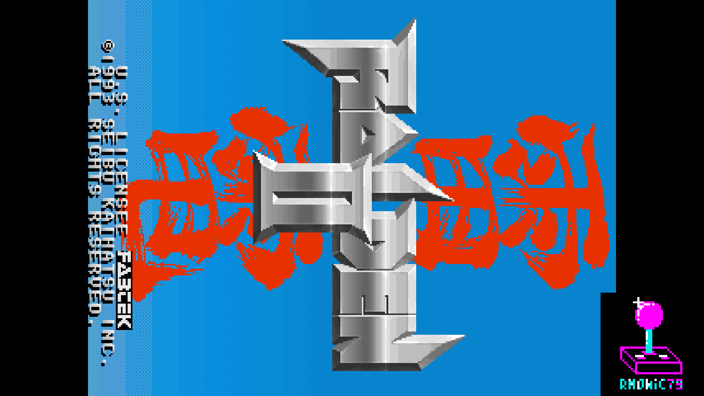 | 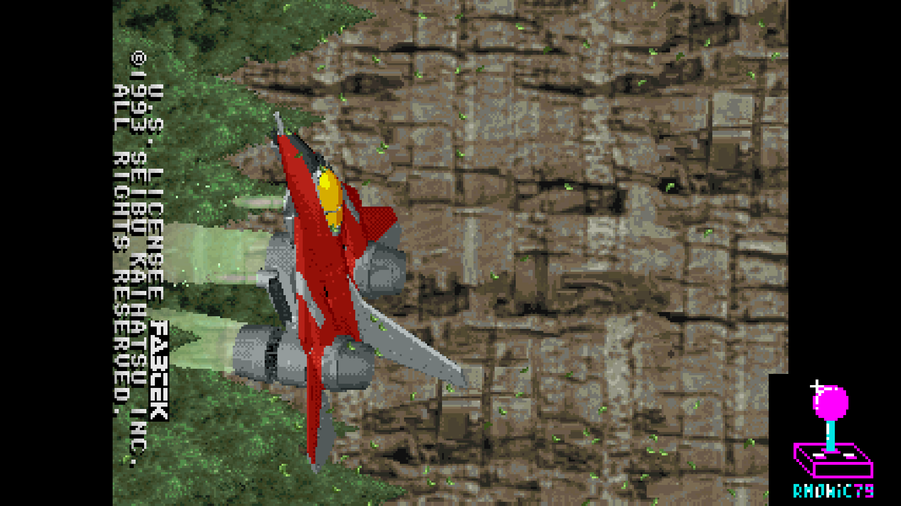 |
| Title | Attract |
| 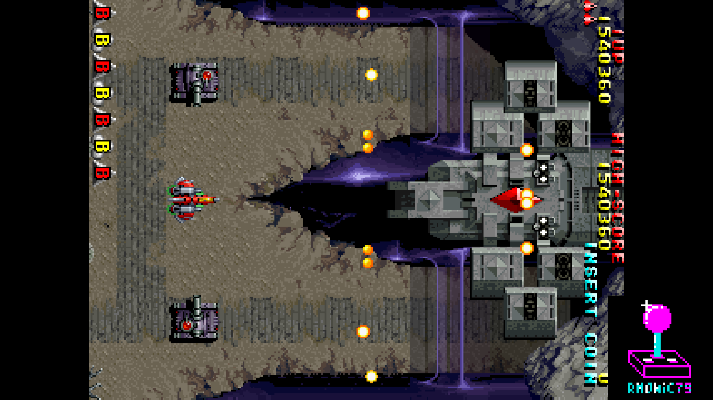 | 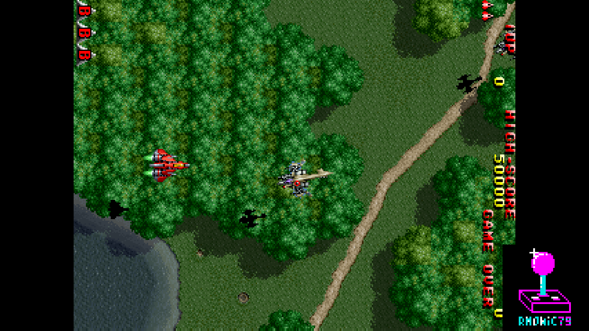 |
| Gameplay | Gameplay |
| 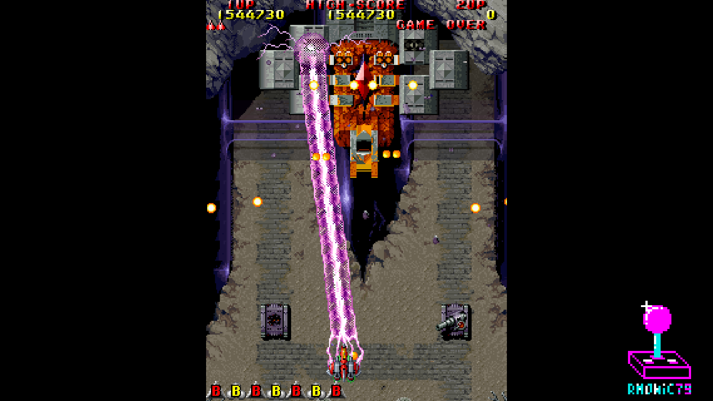 | |
| Gameplay (TATE) | |

**Raiden DX**

| | |
|---|---|
| 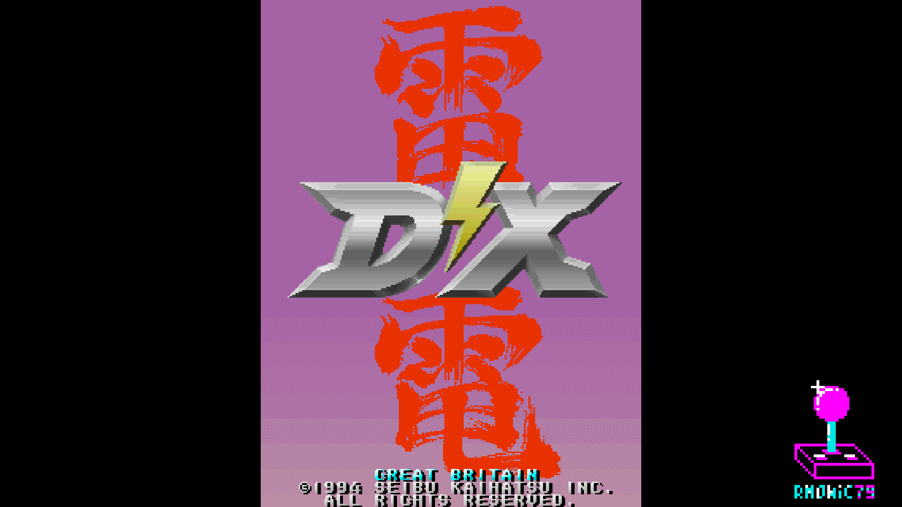 | 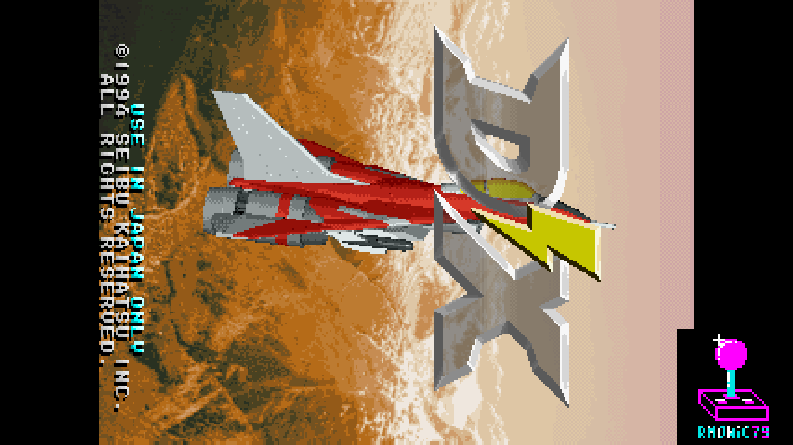 |
| Logo (TATE) | Attract |
| 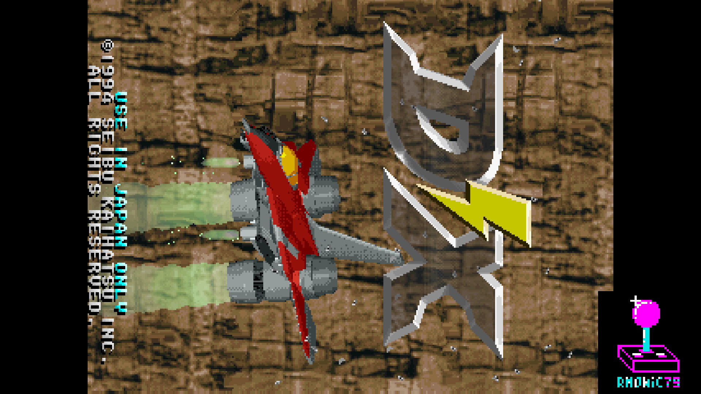 | 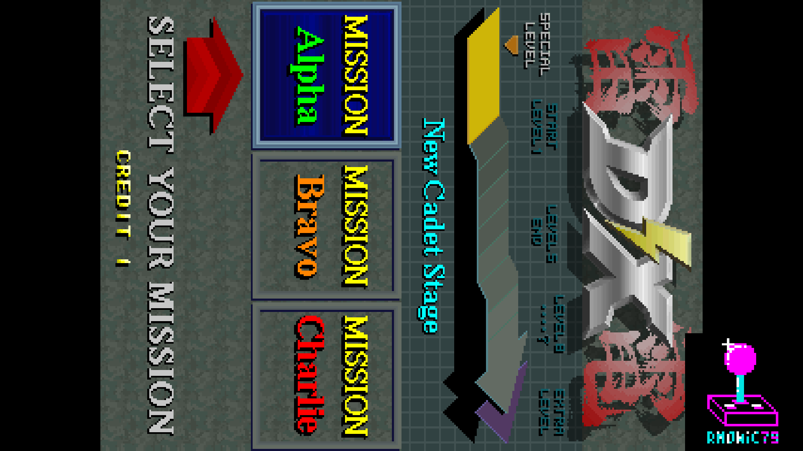 |
| Attract | Course selection |
| 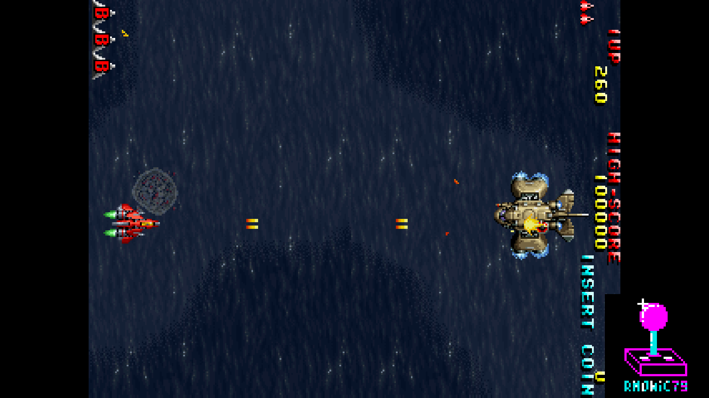 | 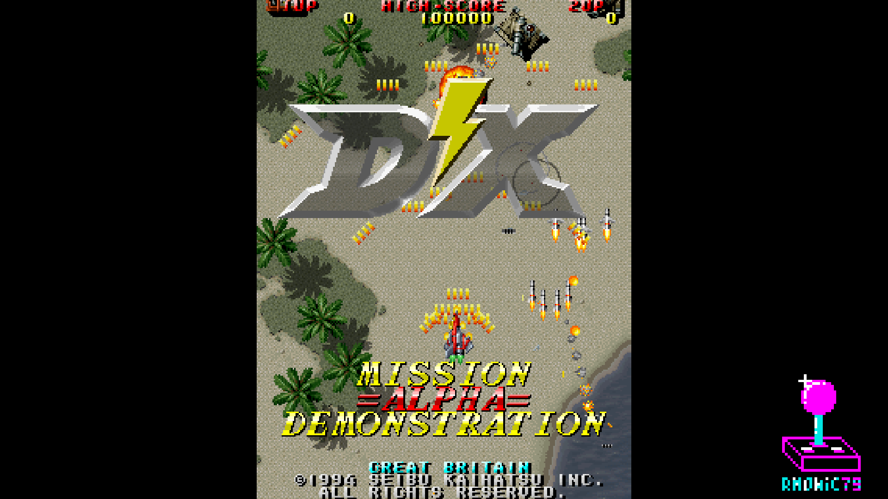 |
| Gameplay | Gameplay (TATE) |

## Hardware emulated

| Component        | Spec                                                 |
|------------------|------------------------------------------------------|
| Main CPU         | NEC V30 @ 16 MHz, cycle-exact                        |
| Coprocessor      | Seibu COP (microcode-driven)                         |
| Sound CPU        | Zilog Z80 (T80)                                      |
| Sound chip 1     | Yamaha YM2151 OPM (jt51)                             |
| Sound chip 2/3   | OKI MSM6295 ADPCM ×2 (jt6295)                        |
| Video            | BG + MG + FG tilemaps + text layer                   |
| Sprites          | Seibu SEI252 sprite generator, encrypted graphics    |
| Video timing     | 320×240 active, 282 lines, 55.4 Hz                   |

## Hardware requirements

- Terasic DE10-Nano
- MiSTer I/O board (recommended)
- SDRAM module (any of the usual MiSTer ones: the core addresses under 8 MB
  per bank — main program, tilemaps and the first OKI ROM)
- DDR3 memory (built into DE10-Nano, used for sprite ROM and OKI ADPCM ROM)
- Works on HDMI displays and on CRTs via the analog video output

## Building from source

Requires Quartus Prime 17.0 (free Lite Edition).

```
Open Raiden2.qpf in Quartus → Processing → Start Compilation
```

Output bitstream is generated in `output_files/Raiden2.rbf`.

## Running on MiSTer

The [releases/](releases/) folder contains the MRA files and a prebuilt RBF:

- the parent MRAs for Raiden II and Raiden DX
- `releases/_alternatives/` — MRAs for all the other regional and revision
  sets
- `Raiden2_YYYYMMDD.rbf` — prebuilt bitstream

Steps:

1. Copy the `.rbf` to `_Arcade/cores/` on the MiSTer SD card, renamed to
   `Raiden2.rbf` (the MRAs look for that name).
2. Copy the `.mra` file(s) to `_Arcade/` on the MiSTer SD card.
3. Provide your legally-owned ROM files where the MRA expects them
   (usually in `games/mame/`).

**ROMs are NOT included in this repository.** You must provide them
yourself.

## Repository layout

```
Arcade-Raiden2_MiSTer/
├── rtl/
│   ├── Raiden2/     Raiden II / DX core RTL (buses, tilemaps, sprites,
│   │   │            COP, Seibu CRTC, audio glue, crt_adjust.sv +
│   │   │            crt_vsize.sv)
│   │   ├── v30/     bus adapter for the cycle-exact V30
│   │   └── crypt/   sprite graphics descrambling
│   ├── ucore/       NEC V30 cycle-exact CPU core (wickerwaka)
│   ├── common/      shared logic: savestate, DDR gate, bridges
│   ├── jtframe/     JTFRAME framework modules
│   ├── sound/       jt51 (YM2151), jt6295 (OKI M6295), t80 (Z80), mixer
│   ├── pll/         Clock PLL
│   └── sdram.sv     SDRAM controller (Sorgelig)
├── sys/             MiSTer framework (Sorgelig / MiSTer-devel)
├── logo/            OSD overlay assets
├── docs/            In-game screenshots
├── releases/        MRA files + prebuilt RBF
├── Raiden2.qpf      Quartus project
├── Raiden2.qsf      Quartus assignments
├── Raiden2.sv       Top-level core wrapper
├── Template.sdc     Timing constraints
├── files.qip        HDL file list
└── README.md        This file
```

## Acknowledgements

- **Martin Donlon** ([wickerwaka](https://github.com/wickerwaka)) for the
  **cycle-exact NEC V30** CPU core, from his
  [`nec_test`](https://github.com/wickerwaka/nec_test) project — a
  microcode-level reimplementation validated against real V30 silicon.
- **Martin Donlon** ([wickerwaka](https://github.com/wickerwaka)) for the
  savestate infrastructure.
- **Jose Tejada** ([@jotego](https://github.com/jotego)) for JT51 (YM2151),
  JT6295 (OKI M6295) and the JTFRAME framework.
- **Andrea Bogazzi** ([@asturur](https://github.com/asturur)) for the work
  on the CRT Adjust module.
- **Daniel Wallner** for the **T80** Z80 CPU core.
- The **MAMEDev team** for the invaluable reference on the Seibu hardware,
  memory maps, the COP, sprite decryption and timing.
- **Sorgelig** and the **MiSTer-devel team** for the framework, SDRAM
  controller and Template.

## Support this project

If you enjoy this core and want to support its development:

- [Ko-fi](https://ko-fi.com/ibecerivideoludici) — one-time support
- [Patreon](https://www.patreon.com/IBeceriVideoludici) — monthly support
- [PayPal](https://www.paypal.me/IBeceriVideoludici) — one-time donation

## Follow

- [GitHub](https://github.com/rmonic79)
- [Twitch](https://twitch.tv/ibecerivideoludici) — live streams
- [YouTube](https://www.youtube.com/c/IBeceriVideoludici) — playlists and videos
- [X / Twitter](https://x.com/rmonic79)

## License

The RTL source code in this repository is provided as-is for educational
and preservation purposes under **GNU GPL v3 or later**. Original ROM data
is not included; users must provide their own legally obtained copies.

Original *Raiden II* and *Raiden DX* arcade hardware © Seibu Kaihatsu,
1993-1994.
